<p align="center">
  <a href="https://kollabpr.vercel.app">portfolio</a> &nbsp;·&nbsp;
  <a href="https://www.linkedin.com/in/kollabathula-preetham/">linkedin</a> &nbsp;·&nbsp;
  <a href="https://www.codespeedy.com/author/k_preetham/">blog</a> &nbsp;·&nbsp;
  <a href="mailto:kollabathulapreetham@gmail.com">email</a>
</p>

<p align="center">
  <a href="https://kollabpr.vercel.app"></a>
</p>

**📬 Reach me** — copy my email:

```
kollabathulapreetham@gmail.com
```

<br>

Software Development Engineer at **AWS Payment Cryptography**. I build the cryptographic services that secure payments online: the systems that move money safely between banks, processors, and merchants.

Before this team I spent three years on **AWS Private Certificate Authority Connectors**, contributing to the Connector for Active Directory and the Connector for Simple Certificate Enrollment Protocol from launch through their later expansions.

I gravitate toward problems where small mistakes compound at scale, prefer one well-instrumented bullet over five plausible-sounding ones, and treat operations as a feature rather than an afterthought.

When I'm not at work, I run a homelab on a NAS, automate my home with Home Assistant, write small Model Context Protocol servers that bridge Claude into my own infrastructure, and 3D-print Pokémon figures on weekends.

**Tools I reach for** — Java · Rust · Python · TypeScript · Go · AWS (Lambda, DynamoDB, KMS, CDK, Step Functions) · Docker · Terraform · PostgreSQL · Redis

The full story, with details and dates, lives at **[kollabpr.vercel.app](https://kollabpr.vercel.app)**.

<br>

<sub>📍 Arlington, VA &nbsp;·&nbsp; 🎮 RyzenWolfy on PC / PS5 / Xbox / Switch</sub>
